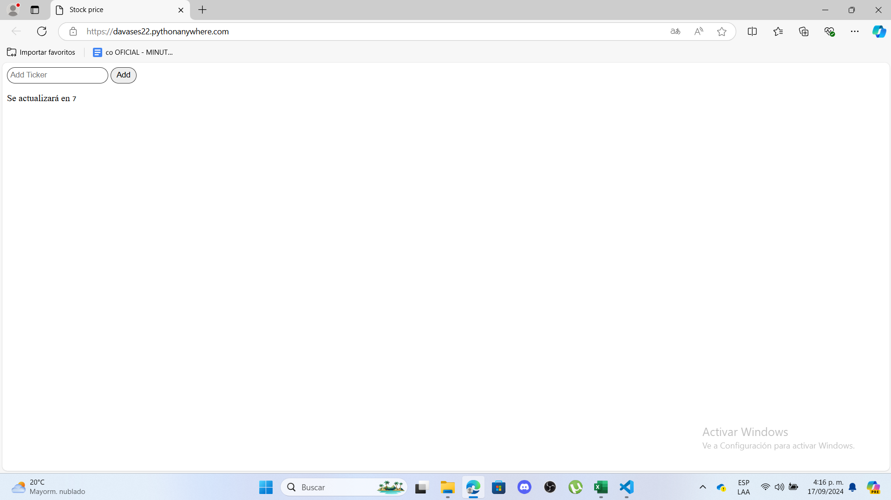
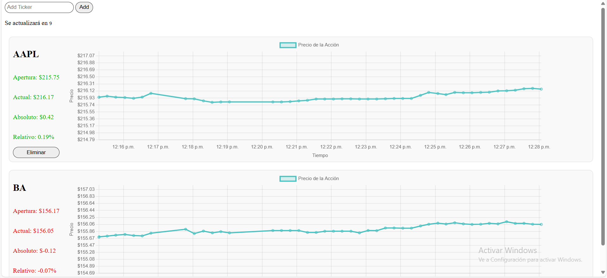
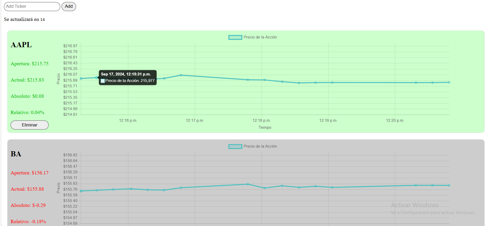
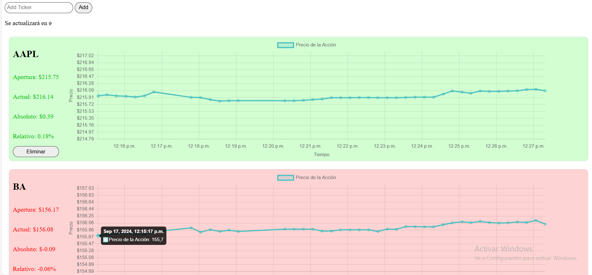
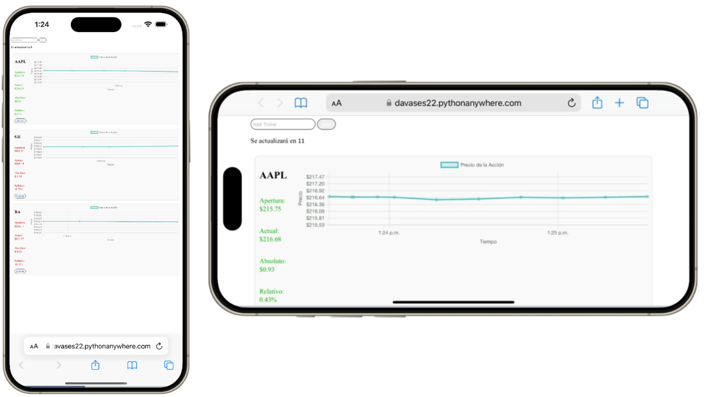

# Analizador de mercado

Herramienta para el análisis de acciones. Alimentada por yahoo finance, esta app busca llegar a tener una interfáz de usuario amigable e intuitiva junto con un modelo predictivo lo suficientemente robusto que funcione para toma de deciciones. Puede acceder a la página web haciendo click [aquí](https://davases22.pythonanywhere.com/)


## Tabla de Contenidos

- [Descripción](#descripción)
- [Características](#características)
- [Tecnologías Utilizadas](#tecnologías-utilizadas)
- [Instalación](#instalación)
- [Uso](#uso)
- [Contribuciones](#contribuciones)
- [Licencia](#licencia)

## Descripción

Este aplicativo web toma información de Yahoo finance a través de su API y la muestra de manera amigable, se está trabajando en un modelo de aprendizaje máquina que pueda realizar recomendaciones a de inversión basadas no solamente en comportamientos pasados sino, usando Web scraping, también en como noticas de esos memomentos repercutieron en el mercado.

## Características

- Adicionar o eliminar títulos de acciones de interés.
- Visualizar datos relevantes como precio de apertura, precio actual, cambios relativos y absolutos.
- Visualización por colores para identificar rápidamente decrementos e incrementos.

## Tecnologías Utilizadas

- **Flask**: Para el backend de la aplicación.
- **yFinance**: Para obtener datos financieros.
- **HTML/CSS/JavaScript**: Para el frontend y la interacción del usuario.
- **Chart.js**: Para visualizar gráficos.

## Instalación

1. **Clona el Repositorio**

```bash
   git clone https://github.com/tu_usuario/tu_repositorio.git
   cd tu_repositorio
```
Configura un Entorno Virtual (Opcional pero recomendado)

```bash
python -m venv venv
source venv/bin/activate  # En Windows usa: venv\Scripts\activate
```
Instala las Dependencias

```bash
pip install -r requirements.txt
```
Uso
Inicia la Aplicación

```bash
python flask_app.py
```
Accede a la Aplicación

Abre tu navegador web y ve a https://davases22.pythonanywhere.com/

Cómo Utilizar la Aplicación

Al abrir el [App web](https://davases22.pythonanywhere.com/) se encontrará con la siguiente interfáz:


Puede adicionar el título de la o las acciones que desee como AAPL (Apple) y BA (The Boeing Company) para ver su información:


La app cada vez que se actualice se coloreará rojo, verde o gris dependiendo de qué cambios haya tenido la acción:



También puede visualizar el contenido en dispositivos móviles:


Si deseas contribuir a este proyecto, sigue estos pasos:

Haz un fork del repositorio.
Crea una nueva rama (git checkout -b feature/nueva-caracteristica).
Realiza tus cambios.
Haz commit de tus cambios (git commit -am 'Añadir nueva característica').
Empuja la rama (git push origin feature/nueva-caracteristica).
Crea un pull request.
Licencia
Este proyecto está licenciado bajo la Licencia MIT. Consulta el archivo LICENSE para más detalles.

¡Gracias por visitar mi proyecto!

## Contacto
Mi nombre es David Espejo y desarrollé el app:

¡Estoy siempre disponible para colaborar y discutir ideas interesantes! Puedes encontrarme en las siguientes plataformas:

[](https://www.linkedin.com/in/david-alejandro-espejo-garcia-298808216/) 
[](https://x.com/DavidEs91503087)
[](https://github.com/Davases22)
[](https://www.instagram.com/davases22/)
[](https://www.youtube.com/@davasplayg2802)


Si quieres hablar sobre tecnología, startups o simplemente saludar, ¡no dudes en enviarme un mensaje!  
📧 Email: [davas.espejo@gmail.com](mailto:davas.espejo@gmail.com)
📧 Email: [davidespejo@espejoyasociados.com](mailto:davidespejo@espejoyasociados.com) 
